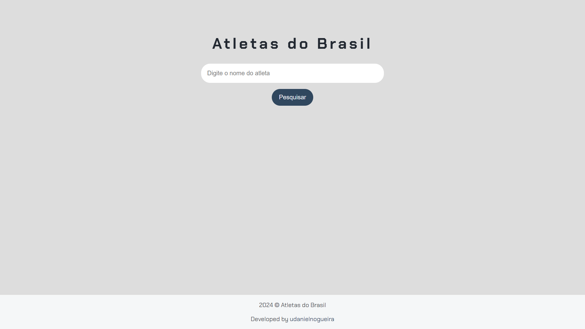
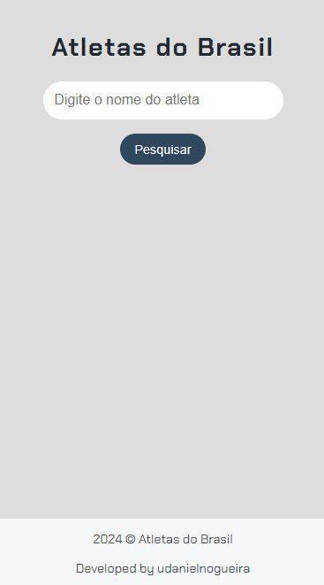

<div align="center">
  
  <h1>Imersão Dev Google Gemini</h1>
  <p>Um projeto desenvolvido durante a Imersão Dev com Google Gemini da Alura.</p>
  
  
  
  
  
</div>

## Sumário

- [Sobre](#about)
- [Preview](#preview)
- [Tecnologias](#built-with)
- [Funcionalidades](#key-features)
- [Destaques](#highlights)
- [Meu contato](#contact)

<h2 id="about">Sobre</h2>

Uma aplicação desenvolvida em HTML, CSS e JavaScript para pesquisar atletas olímpicas que foram destaque nas Olimpíadas de Paris em 2024, projeto realizado na Imersão Dev com Google Gemini da Alura.

<h2 id="preview">Preview</h2>

Desktop



Mobile



<h2 id="built-with">Tecnologias</h2>

- CSS
- HTML
- JavaScript

<h2 id="key-features">Funcionalidades</h2>

- [x] Inserir termo(s)
- [x] Pesquisar termo(s) inserido(s)
- [x] Visualizar resultado(s) da pesquisa

<h2 id="highlights">Destaques</h2>

Uso de uma base de dados em JS.

```js
let atletas = [
  {
    nome: "Rebeca Andrade",
    descricao: "Rebeca Andrade é a maior ginasta brasileira de todos os...",
    link: "https://pt.wikipedia.org/wiki/Rebeca_Andrade",
    tags: "ginástica ginastica",
  },
  {
    nome: "Bia Souza",
    descricao: "Bia Souza é uma judoca brasileira que conquistou os...",
    link: "https://pt.wikipedia.org/wiki/Beatriz_Souza",
    tags: "judô judo judoka",
  },
  {
    nome: "Rayssa Leal",
    descricao: "Rayssa Leal, conhecida como Fadinha, é uma skatista...",
    link: "https://pt.wikipedia.org/wiki/Rayssa_Leal",
    tags: "skate fada sk8",
  },
];
```

<br>

Injeção de HTML via JS.

```js
if (
  nome.includes(campoPesquisa) ||
  tags.includes(campoPesquisa) ||
  descricao.includes(campoPesquisa)
) {
  boxResultados.innerHTML += `
  <div class="item-resultado">
  <h2>${atleta.nome}</h2>
  <p class="descricao-meta">${atleta.descricao}</p>
  <a ${atleta.link}" target="_blank">Mais informações</a>
</div>`;
}
```

<h2 id="contact">Meu contato</h2>

LinkedIn [@udanielnogueira](https://www.linkedin.com/in/udanielnogueira/)
